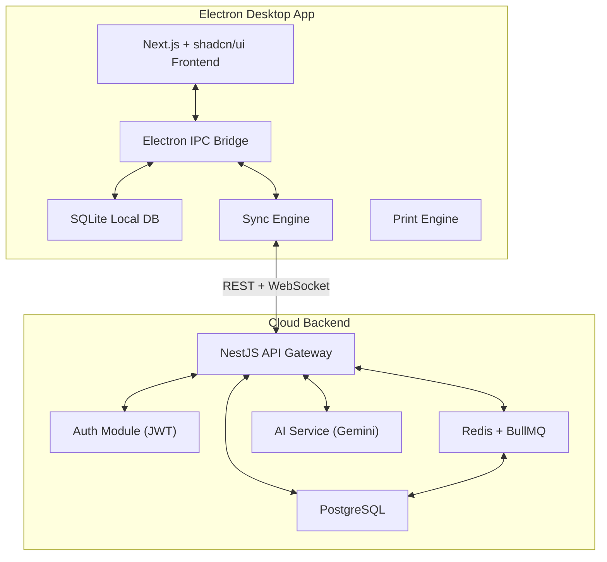

# InBill ERP — Master Architecture & Redesign Plan

This document contains the complete technical blueprint for transforming the current niche-based software into a scalable, universal, AI-powered ERP platform.

---

## 1. SOFTWARE ARCHITECTURE OVERVIEW

### High-Level System Design
The system uses a **Modern Desktop-First** approach with an **Offline-First Sync Architecture**.

### Key Architectural Pillars
1.  **Monorepo Structure**: Uses `pnpm` workspaces to manage the Desktop App, Cloud API, and Shared Packages (types, utils, validation).
2.  **Modular Monolith**: Initially built as a single backend service for speed, but split into logical modules (Sales, Inventory, Auth) ready for microservices.
3.  **IPC Modular Routing**: Electron Main process split into domain-specific handlers (`products.ipc.ts`, `sales.ipc.ts`) to avoid a bloated `main.js`.
4.  **Offline-First**: All writes go to local SQLite first. A background sync engine handles pushing to Cloud PostgreSQL when internet is available.

---

## 2. DATABASE DESIGN

### Multi-Tenant Strategy
Every table includes a `business_id`. Locally, this is always the current user's ID. In the cloud, this ensures data isolation between different businesses.

### Core Schema (Prisma)
-   **Business**: Stores name, address, GSTIN, logo, and configuration.
-   **Branches**: Supports multi-location businesses.
-   **Users & Roles**: RBAC (Owner, Admin, Staff).
-   **Universal Products**: Dynamic categories, units, and JSON `custom_fields`.
-   **Parties**: Unified Customer/Supplier management with current balances.
-   **Sales/Purchases**: Full GST compliance (CGST/SGST/IGST).
-   **InventoryMovements**: Immutable ledger of every stock change (In/Out/Adjustment).
-   **Transactions**: Financial ledger for payments and accounting.

---

## 3. UNIVERSAL PRODUCT ENGINE (METADATA-DRIVEN)

### The Architecture
1.  **Attribute Definitions (`product_attribute_defs`)**: Stores the "Schema" for a business (Field name, type, required).
2.  **Attribute Values**: Stored as JSON in the `products` table for flexibility.
3.  **Dynamic UI Engine**: Forms are generated dynamically from metadata.
4.  **Template-Based Onboarding**: Business Types serve as templates for pre-populating fields and categories.

---

## 4. OFFLINE-FIRST SYNC ENGINE

### Strategy
1.  **Sync Queue**: Every local change is logged into a `sync_queue` table in SQLite.
2.  **Conflict Resolution**: Uses "Last-Write-Wins" per field based on `updated_at` timestamps. Financial records use "Server-Wins" to prevent double-spending/errors.
3.  **Background Worker**: Electron Main process runs a sync loop every 30-60 seconds.

---

## 5. PRINTING SYSTEM

-   **Template Engine**: HTML/CSS templates rendered to PDF or Thermal format.
-   **GST Compliance**: Automated calculation of CGST, SGST, and IGST based on the state of supply.
-   **Thermal Integration**: Direct USB/Network printing for 80mm/58mm POS printers.

---

## 6. AI FEATURES (GEMINI INTEGRATION)

-   **OCR Scanning**: Extract products from supplier invoices automatically.
-   **AI Setup**: Describe your business, and AI creates your initial product catalog.
-   **Natural Language Search**: "Show me all high-margin products sold last week."
-   **AI Reports**: Weekly summaries of business health and optimization tips.

---

## 7. SECURITY & SCALABILITY

-   **Security**: JWT with Refresh Tokens, BCrypt hashing, and Electron `safeStorage` for local keys.
-   **Scalability**:
    -   **Phase 1**: Single VPS with Docker.
    -   **Phase 2**: Read-replicas for PostgreSQL + Redis caching.
    -   **Phase 3**: Global distribution with Cloudflare/AWS.

---

## 8. DEVELOPMENT ROADMAP

### Phase 1: Universal Foundation (Immediate)
-   Remove hardcoded "AF NUTRITION" branding.
-   Implement `business_profile` table.
-   Add first-time Setup Wizard.
-   Make categories dynamic.

### Phase 2: Professional ERP Features
-   GST Reports (GSTR-1, GSTR-3B).
-   Stock movement history.
-   Credit/Debit notes.
-   Thermal printing support.

### Phase 3: Cloud & Multi-User
-   NestJS Backend implementation.
-   Sync Engine integration.
-   Multi-user login and roles.

---

**This plan transforms InBill from a local niche tool into a professional, scalable Saral-competitor.**
