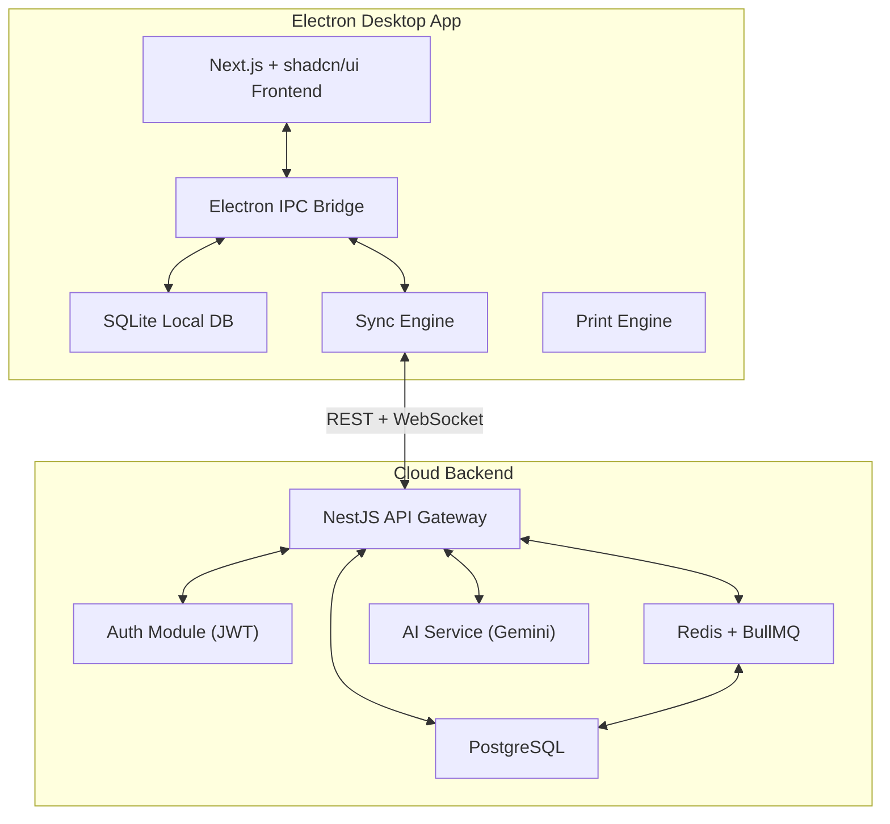
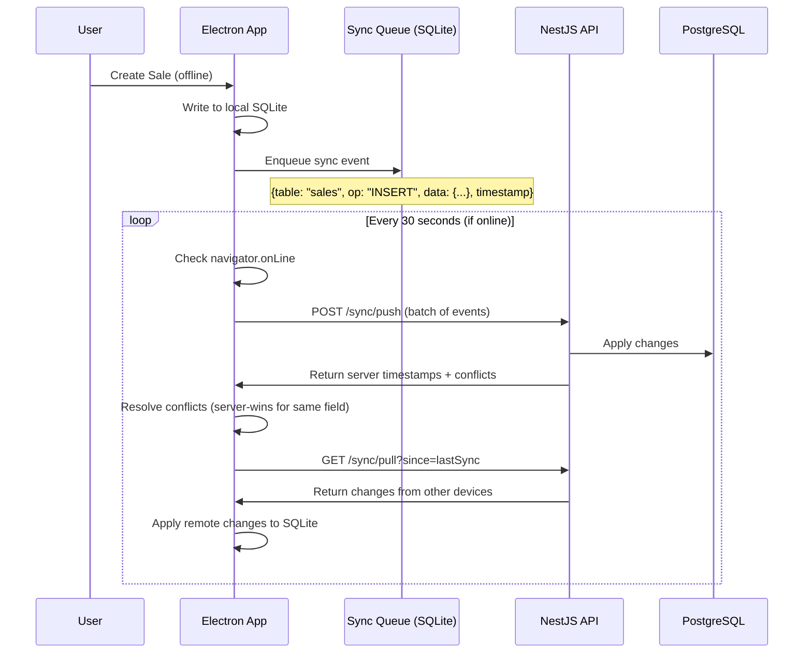

# InBill ERP — Architecture Overview & System Design

## Executive Summary
Transform current single-niche Electron+Next.js+SQLite app into a **universal, AI-powered, offline-first ERP** using a monorepo with NestJS cloud backend, Prisma ORM, PostgreSQL cloud DB, and Redis queues.

---

## 1. High-Level System Architecture



## 2. Monorepo Structure (pnpm workspaces)

```
inbill/
├── apps/
│   ├── desktop/                  # Electron + Next.js desktop app
│   └── api/                      # NestJS Cloud Backend
├── packages/
│   ├── shared-types/             # Shared TypeScript interfaces
│   └── shared-utils/             # Shared utility functions
└── prisma/
    └── schema.prisma             # Single source of truth for DB schema
```

## 3. Offline-First Sync Architecture



### Sync Queue Table (SQLite)
```sql
CREATE TABLE sync_queue (
  id          INTEGER PRIMARY KEY AUTOINCREMENT,
  entity_type TEXT    NOT NULL,
  entity_id   TEXT    NOT NULL,
  operation   TEXT    NOT NULL,
  payload     TEXT    NOT NULL,
  created_at  TEXT    DEFAULT (datetime('now')),
  synced      INTEGER DEFAULT 0
);
```
