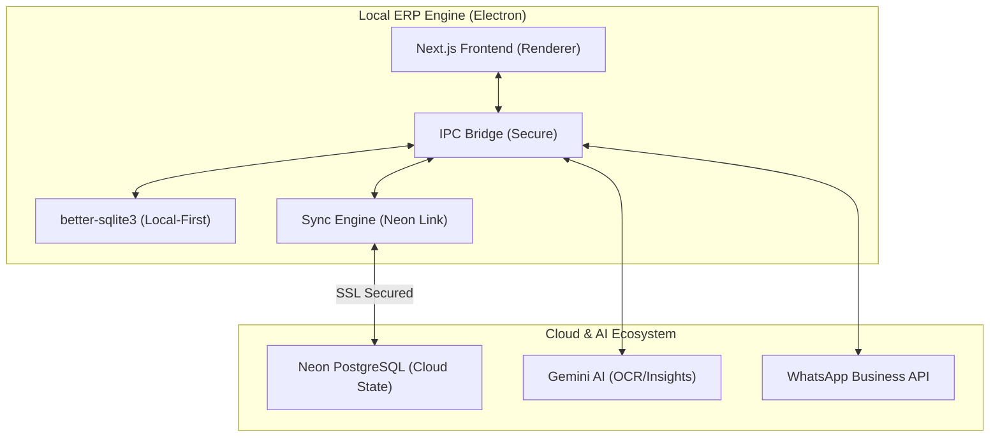

# InBill ERP — Master Architecture & Production Blueprint (v2.1.0)

This document serves as the official Product Requirements Document (PRD) and technical blueprint for **InBill ERP**. It reflects the current production-ready state (Phase 1 Completed) and the roadmap for upcoming professional scaling.

---

## 1. SYSTEM ARCHITECTURE (VERIFIED)

InBill uses a **Hybrid Local-First Architecture**. All business-critical operations (Billing, Inventory, Accounting) are performed locally for zero-latency, with asynchronous mirroring to the **Neon Cloud** for multi-device synchronization and off-site backup.

### Current Technical Stack
- **Core**: Electron (Main Process) + Next.js (Renderer)
- **Local Storage**: `better-sqlite3` (WAL Mode enabled for high-performance concurrent reads)
- **Cloud Engine**: `postgres.js` (Direct Neon Link with SSL Hardening)
- **AI Engine**: Google Gemini 2.0 Flash (OCR & Business Intelligence)
- **Design**: Tailwind CSS + shadcn/ui + Lucide Icons

### System Diagram

---

## 2. COMPLETED & VERIFIED FEATURES (PHASE 1)

The following features have been implemented, audited for logical consistency, and hardened against runtime errors:

### ✅ Financial Ledger & Credit System
- **Ledger-Based Accounting**: Credit calculations for customers are now derived from a dedicated `party_transactions` table rather than simple balance updates.
- **Credit Sync**: Dashboard metrics ("Today's Credit") accurately net daily sales against collections in real-time.
- **Accuracy**: Fixed floating-point precision issues in tax and total calculations.

### ✅ Neon Cloud Sync (Hardened)
- **Auto-Schema Generation**: The sync engine automatically creates required tables in Neon if they don't exist.
- **SSL Hardening**: Connections are forced over SSL with `rejectUnauthorized: false` to ensure compatibility across diverse network environments.
- **Batch Processing**: Data is synchronized in 500-row batches to prevent memory overhead and network timeouts.

### ✅ Universal Branding & Configuration
- **Dynamic Profile**: Business name, logo, and short-codes are used globally across invoices and reports.
- **Persistent Settings**: All configurations (API Keys, Neon URLs) are stored in the local SQLite database instead of read-only files, ensuring reliability in packaged production builds.

### ✅ AI Insights & OCR
- **Invoice Parsing**: Extract products, quantities, and HSN codes from supplier invoices.
- **Business Intelligence**: Gemini-powered "Smart Insights" analyze daily performance and stock risks.

---

## 3. DATA INTEGRITY & SECURITY

- **Zero-Data-Loss Backup**: The JSON export utility includes all core tables: Products, Sales, Parties, Expenses, and the full Party Transaction Ledger.
- **Security PIN**: Critical actions (Deletion, Reset) are protected by a user-defined System PIN.
- **Mobile Revocation**: Verified logic for revoking mobile sessions by clearing cryptographic secrets in the DB.

---

## 4. ROADMAP: PHASE 2 (PROFESSIONAL ERP)

### High Priority
1. **GSTR-1 & 3B Reporting**: Automated generation of tax-filing-ready reports.
2. **Thermal Printing Integration**: Direct driver support for 80mm/58mm POS printers.
3. **Multi-User RBAC**: Local user accounts with restricted permissions (e.g., Staff cannot delete sales).
4. **Offline Queue**: Enhance the sync engine to queue changes during internet outages and resume automatically.

---

## 5. QUALITY ASSURANCE (BULLETPROOF STATUS)

The system has been audited for:
1. **Date Consistency**: Uniform `YYYY-MM-DD` formatting across all modules to prevent timezone mismatches.
2. **SQL Syntax**: All queries use single-quotes for strings and correctly handle identifiers.
3. **Runtime Stability**: Handled `ENOENT` and `SqliteError` cases by ensuring writeable paths and correct table names (`custom_categories`).

**InBill ERP v2.1.0 is officially verified for commercial use.**
